# dorayaki-frontend
Welcome to my dorayaki stock management frontend app repository for my programming lab assistant test submission!

Deployment Link: [https://dorayaki-frontend-afif.vercel.app/](https://dorayaki-frontend-afif.vercel.app/) (Update 8/29/21 backend server turned off)

## How to Run Locally
Make sure you have [npm](https://www.npmjs.com/package/node) installed. Run:
```bash
npm run dev
```
The app will run in [http://localhost:3000/](http://localhost:8080/)

## Features
* Store List
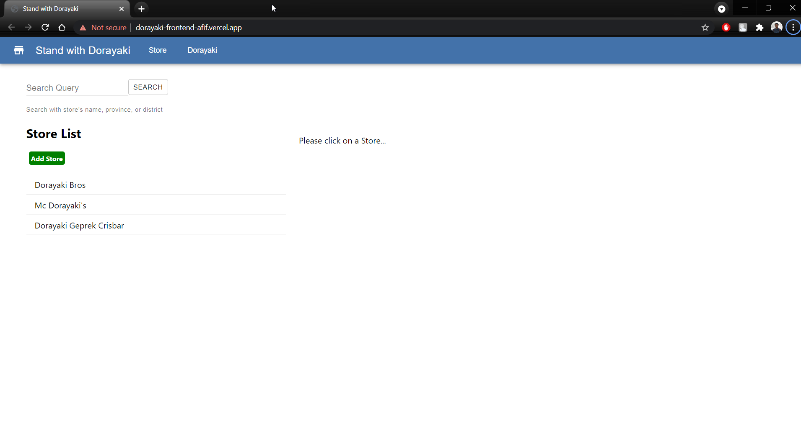
* Add store
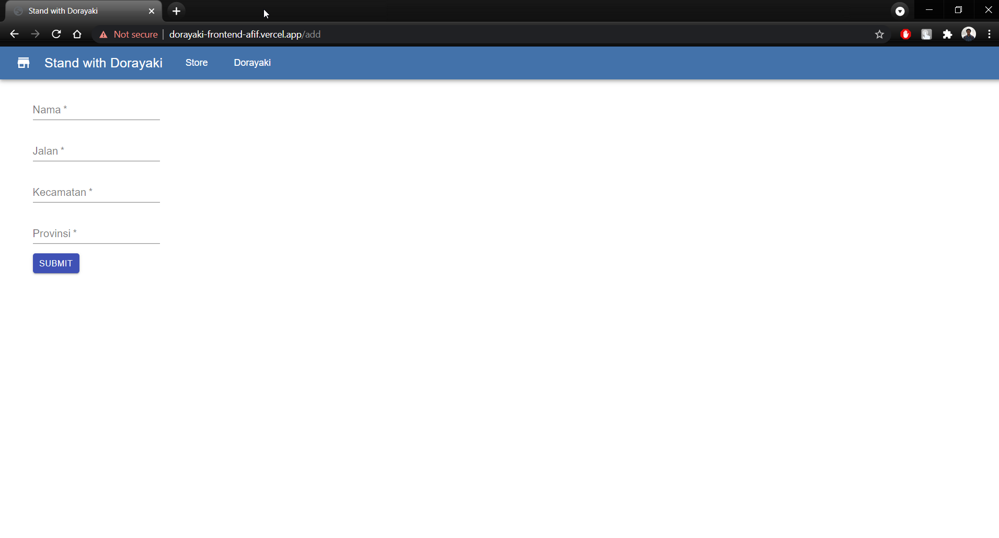
* Dorayaki Variant List
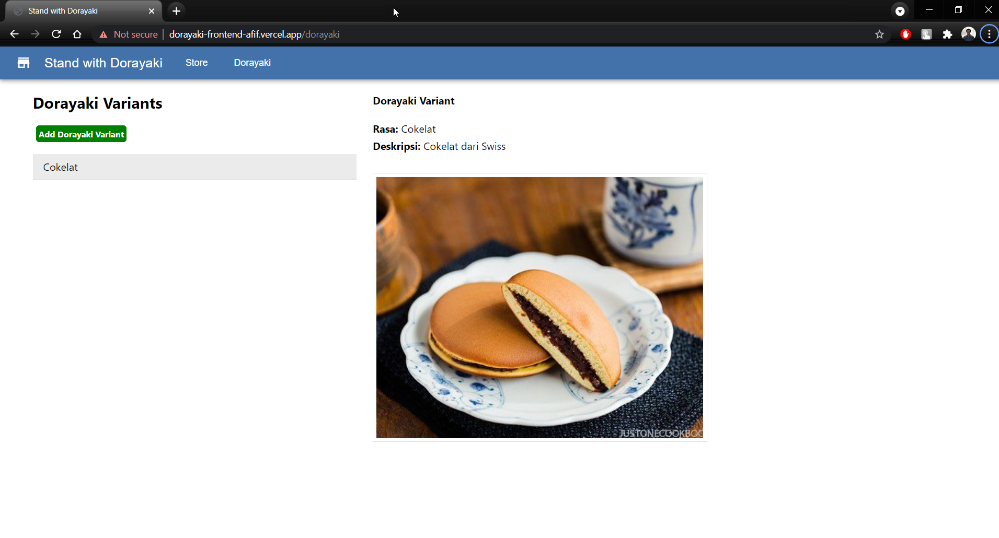
* Add dorayaki variant
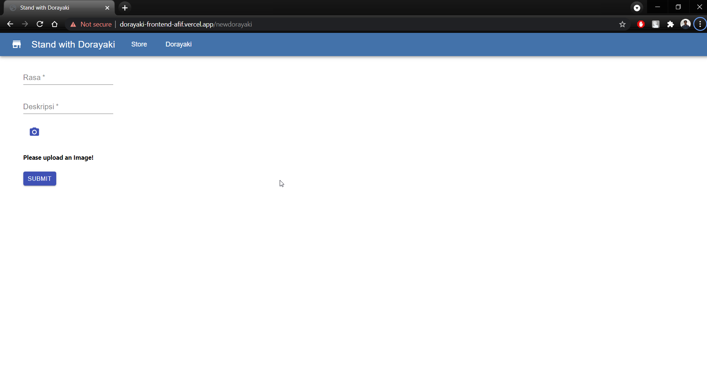
* Add dorayaki variant uploader
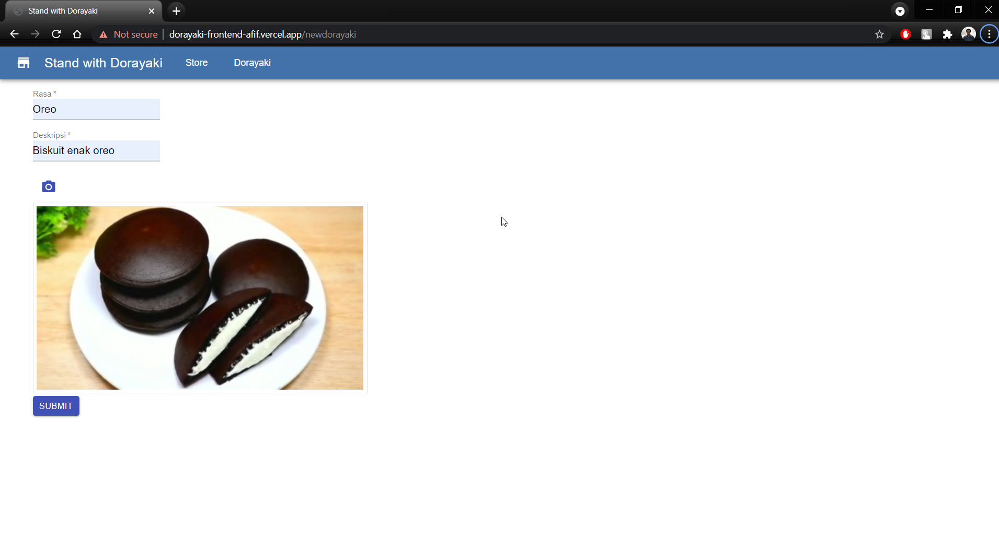
* Search query with store name
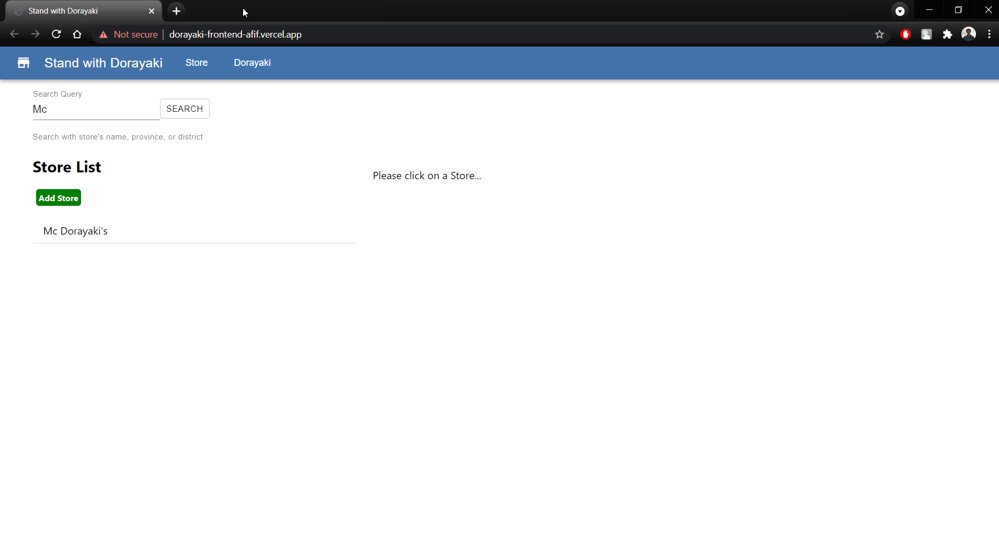
* Search query with province/district name
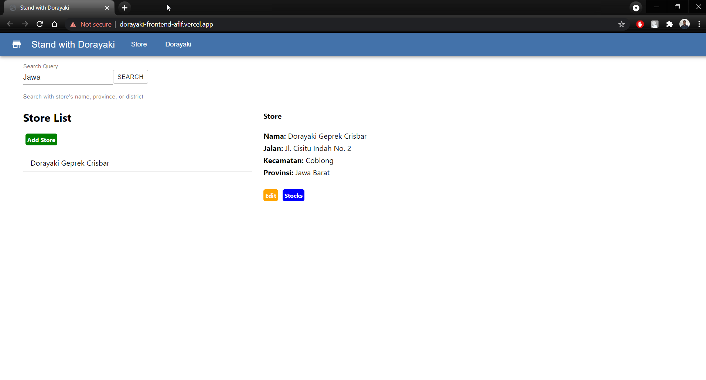
* Edit store
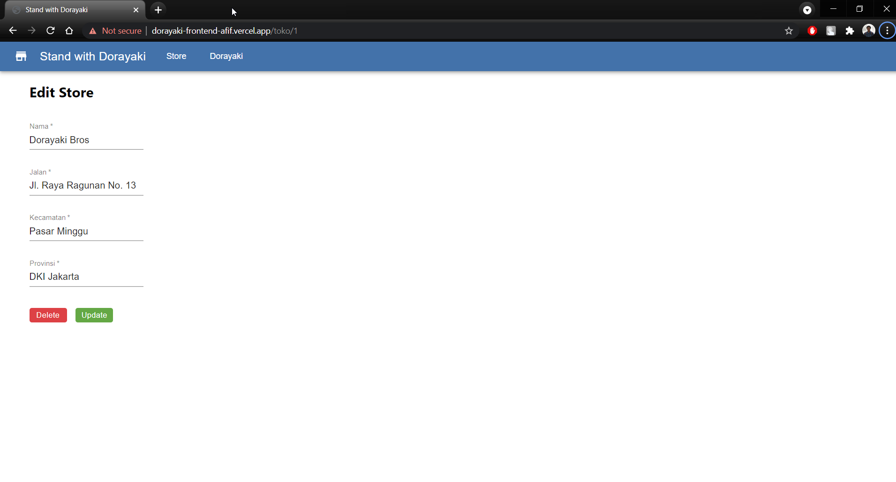
* Stock list
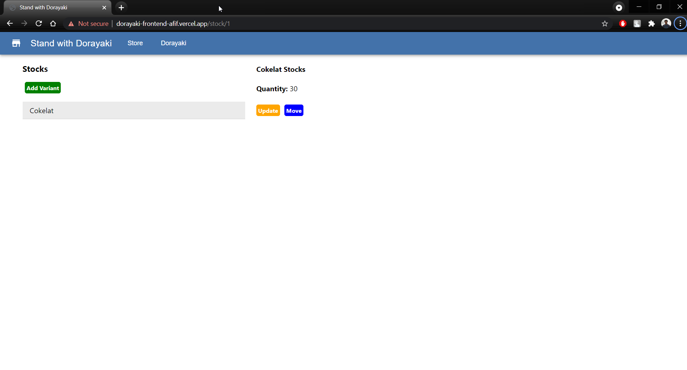
* Add variant to store
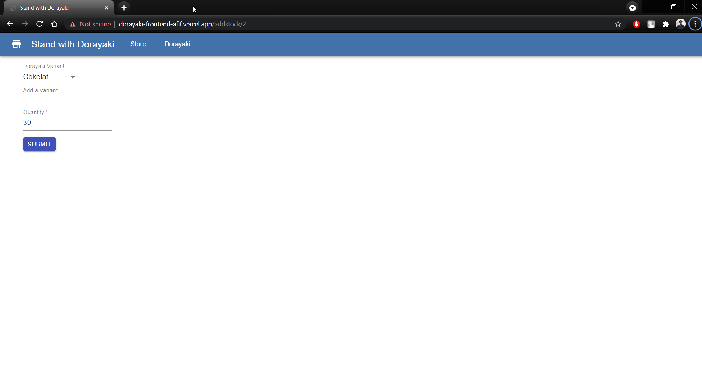
* Update stock
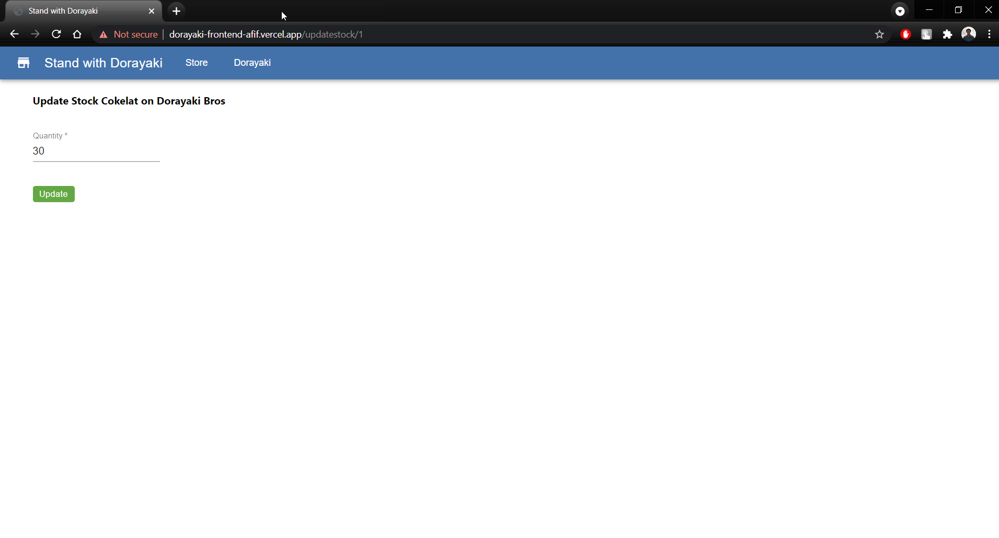
* Move stock
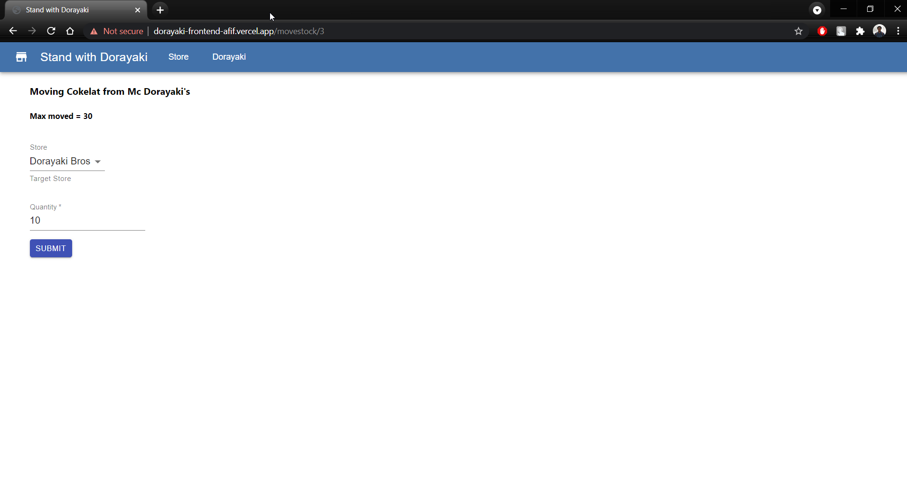

## Author
Afif Fahreza 18219058
